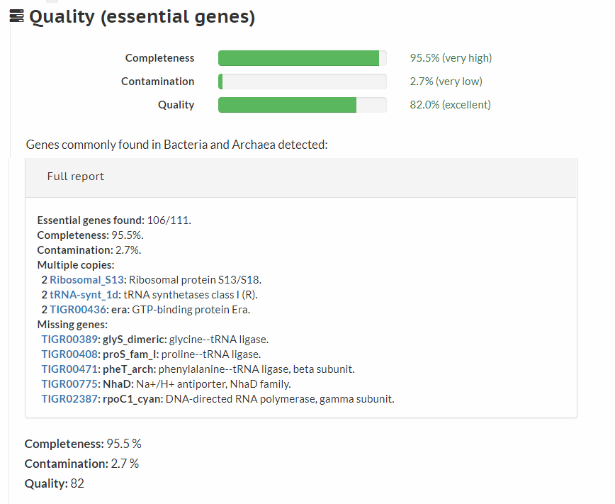
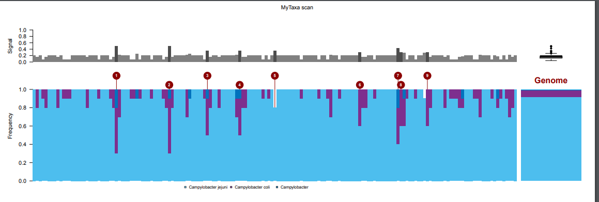
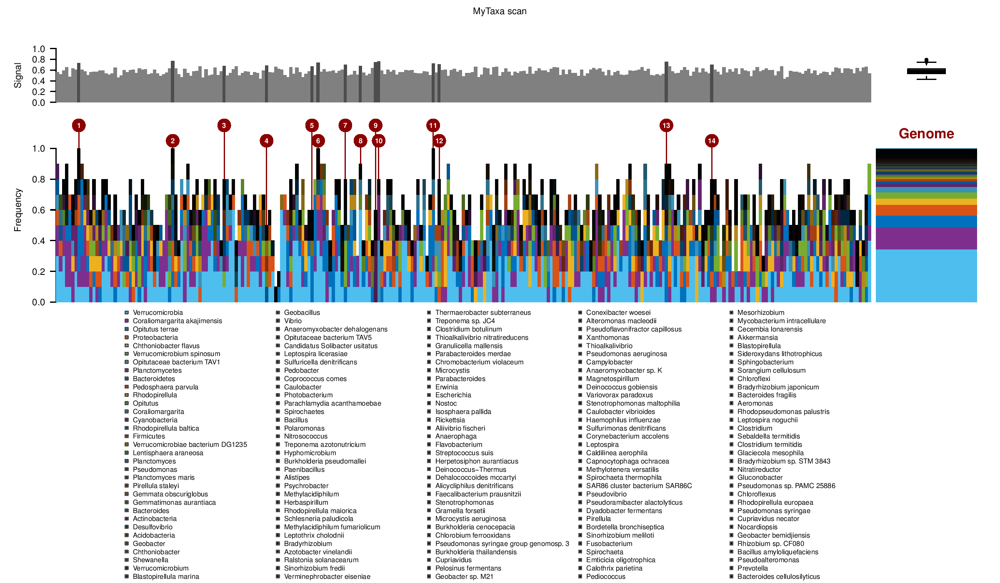

# Quality

## Summary Statistic

Clicking on the Quality heading on the Results page accesses a summary statistic related to the quality of the query genomic sequence or a genome in the reference database. This summary statistic relates completeness and contamination. Completeness is measured by the presence of 111 single-copy genes which are observed across almost all prokaryotic genomes, while contamination is measured by the frequency at which these genes are present in more than one copy. The display below includes the "Full report" obtained by clicking on the button so named. 

Our example genome is a high-quality assembly as it contains 106 out of 111 single copy genes. It also shows redundancy of three of these genes, with each one showing two copies. Quality scores are then calculated as completeness percentage minus five times contamination percentage. This frequency of duplicated genes can also be referred to as chimerism as it usually but not necessarily always is indicative of a chimeric combination between the sequence of the main genome and other highly similar but distinct sequences from other organisms. Chimerism can arise during binning or can reflect actual DNA contamination, depending on the source. It is important to note that this is a universal attempt at quality assessment. Further analysis via techniques such as single cell amplified genomes can confirm if the multiple copies of traditional single-copy genes are real or the product of chimerism. This chimerism can also be explored further via the MyTaxa scan tool.

## MyTaxa Scan

MyTaxa scan provides another means of quality checking. This is a CPU intensive task and an optional analysis that a user has to request by checking the corresponding box when submitting the analysis. MyTaxa scan scans the whole input genome in windows of ten genes and determines the phylogenetic origin of each window. MyTaxa then flags windows that deviate significantly from the genome average. When the analysis is finished, a PDF report is generated which provides information on the distance of each window from the average of the genome and options to check the origin of each window, download the corresponding genes, or other options. Windows that deviate from the genome average may represent cases of recent horizontal gene transfer or contamination. For further details on MyTaxa scan, refer to the original MyTaxa publication. <insert link to refernece>

The My taxa scan pdf for the high quality genome above shows little evidence of contamination:

My taxa results for a low quality genome would look more like this:

## Gene Prediction & Assembly

Finally, doenload links to information on gene prediction and assembly length of the input genomic sequence is also included on the results page.

## Summary

By utilizing the available information generated by MiGA users can thoroughly evaluate the quality of their assembled genomic sequences and even make further inferences about the success of different assembly or binning pipelines. In the end, areas of chimerism should always be manually examined and may not always indicate diminished genome quality; they may be cases of  recent horizontal gene transfer or other naturally occurring genetic deviation.
