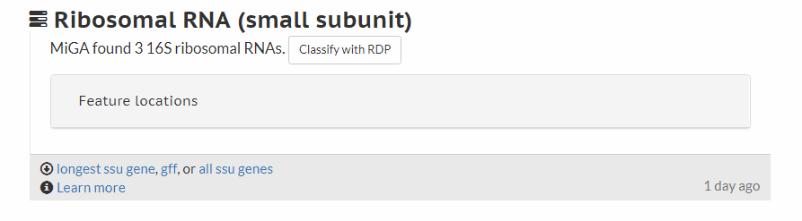

# Results

Access results of a query by selecting **Dashboard** from the drop down menu in the upper right of any page, click on **Query data set**, and then click on the name of your query. You will be presented with a page similar to that below, perhaps with **Distances** already open. The headings shown depend on the analysis made. **MyTaxa Scan** and **Quality** provide information related to the quality of genomes (query and reference) and will be discussed in the Quality section.

You can open and close each of the result sections (Distances, Ribosomal RNA, Quality, Gene prediction, and Assembly) by clicking on the section title.

### Distance

If you click on the Distance bar, you get something that looks like this:

The closest matches in the data base are displayed under Distance, the classification with probabilities under Taxonomic classification, and the probability that the query genome belongs to a new taxon under Taxonomic novelty. Links under Genomic relatedness give the relationship to closest matches in the form of a tree and  a table of AAI percentages.

Relationships are calculated on the basis of ANI (average nucleotide identity)  and AAI (average amino acid identity). MiGA makes inferences based on the obtained values and predetermined thresholds for each taxonomic rank. For instance, if a given sequence shares at least 95% ANI with a reference genome, there is a high likelihood that it should be assigned to the same species. For more divergent query sequences AAI, is used. Genome sequences are hypothesized to be from the same genus if they have an AAI above 65%. If the sequences show AAI between 45 and 65%, they are hypothesized to be from the same family. Further information on this approach and thresholds used can be found by clicking on the information icons (blue circles with i's in them) next to each title.

MiGA’s P-values for each assignment to a taxonomic rank reflect the confidence for the assignment given the distribution of AAI or ANI values among all genomes grouped at the same rank, e.g., all members of a species for species-level assignments and where within this distribution the corresponding ANI values between the query sequence and its best matching reference genome fall. That is why MiGA will not make any inferences on p-values over 0.5 as that indicates a greater possibility that the identity value obtained for the query genome lies outside of the distribution of values for the taxonomic rank in evaluation than inside of it.

MiGA also provides a confidence (p-value) that the genome is novel at a specific rank that is essentially the inverse of the p-values of classification in the previous step. Here you see the classifications with the higher p-value from before expressing the higher confidence that they do belong to novel classifications. For our sample genome, there is high confidence that the sequence belongs to a species, genus, and family not represented by the genomes in the reference database.

Below this section is an AAI table which shows AAI values for the query sequence against the closest related genomes in the database. 

In this example, we can see that with an AAI of 73.13% a confident assignment to genus is made. The other reference genomes listed have AAI' of ~55% and belong to a different family (*Vibrionaceae*). Closer examination of the ANI table allows the user to infer species level similarity.

### Ribosomal RNA

Analysis of the 16S ribosomal RNA gene is also offered when the gene sequence is detected. Classify it with the RDP classifier by clicking on the link  or download the sequences by clicking on the download icon (downward pointing arrow).

The thresholds on sequence similarity are based on the thresholds  established by the Ribosomal Database Project, or RDP: 

| Same    | % Similarity | Novel  | % Similarity |
| ------- | -------------| -------| -------------|
| Family  |    92-95     | Domain |     < 75     | 
| Genus   |   95-98.6    |Phylum  |    75-83     |
| Species |    95-100    | Order  |    83-86     |
| -       |   -         | Class  |    86-89     |
| -       | -            | Family |    89-92     |

To summarize, MiGA offers a variety of graphical outputs in order to help users understand their sequences and classification results. Understanding the goals and limitations of each analysis is essential to accurate interpretation. Often, confident classification can only be made at specific ranks of taxonomy and not others. MiGA’s classification strength will continue to grow as more reference genomes become available. So please deposit your new genome sequences to MiGA! 